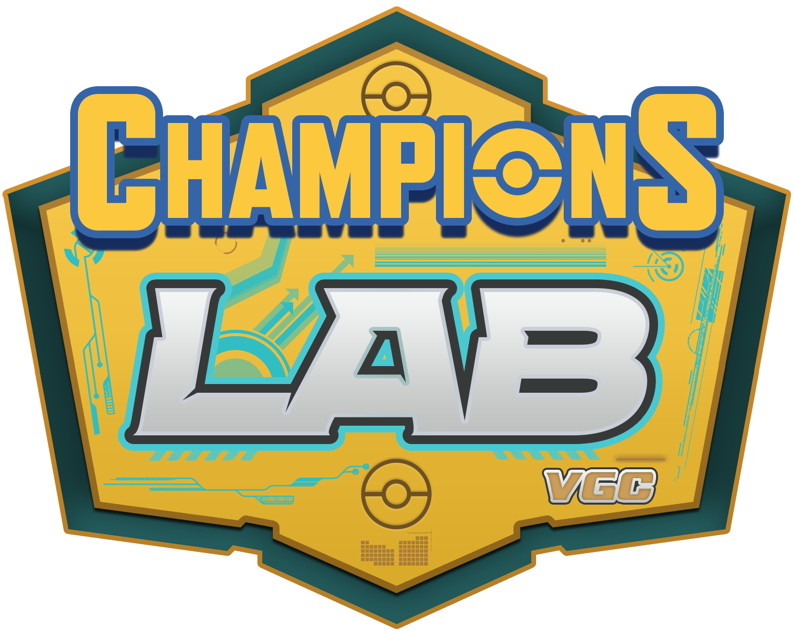

<p align="center">
  
</p>

<h1 align="center">Champions Lab</h1>

<p align="center">
  <strong>A free competitive companion for Pokémon Champions 2026 — built with love by fans, for fans</strong>
</p>

<p align="center">
  <a href="https://championslab.xyz">🌐 Live Site</a> · 
  <a href="https://github.com/Andrew21P/ChampionsLab">📦 GitHub</a> · 
  <a href="#features">✨ Features</a> · 
  <a href="#tech-stack">🛠 Tech Stack</a> · 
  <a href="#contributing">🤝 Contributing</a>
</p>

<p align="center">
  
  
  
  
  
</p>

---

## ❤️ Why Champions Lab?

We love Pokémon. Seriously — we've been playing VGC for years and we wanted to build the competitive companion we always wished existed. **Champions Lab is 100% free, has no ads, and no paywalls.** We built this during our free time because we believe every trainer deserves access to great tools, regardless of budget.

If you find it useful, share it with a friend. That's all the support we need.

> **Play it now at [championslab.xyz](https://championslab.xyz)**

---

## Features

### 📖 Pokédex
Browse **147 competition-legal Pokémon** (136 base + 11 regional forms) with full stats, abilities, move pools, and tier rankings. Filter by type, generation, tier, or Mega Evolution status. Every Pokémon has a detailed modal with Stats, Moves, Abilities, Usage, and Teams tabs.

### 🧩 Team Builder
Interactive team creation for up to 6 Pokémon with:
- **SP System** — 66 Stat Points per Pokémon (max 32 per stat)
- Move, ability, nature, item, and Tera Type selection
- AI-powered teammate suggestions and set recommendations
- Synergy analysis — role coverage, type overlaps, core pair detection
- Save, load, share (compressed URLs), and Showdown import/export

### ⚔️ Battle Engine
A Monte Carlo doubles battle simulator with VGC-realistic AI:
- 2,000,000+ simulated battles powering the meta rankings
- 242+ moves, 200+ abilities, items, weather, terrain, Trick Room, Tailwind
- Mega Evolution and Tera Type support
- Turn-by-turn battle logs and replays
- 40+ curated meta teams and randomized opponents

### 📊 Meta Analysis
Data-driven competitive dashboard:
- ML-powered Pokémon rankings with ELO and win rates
- Tournament data from 250+ real competitive results
- Core pair analysis from ML simulation and tournament history
- Archetype matchups and move win-rate analysis

### 🎓 PokéSchool
Educational hub covering:
- VGC ruleset (Doubles, Bring 6 Pick 4, Team Preview)
- Role guides — sweeper, wall, pivot, support
- Strategy fundamentals for the Champions format

---

## Tech Stack

| Technology | Purpose |
|:--|:--|
| [Next.js](https://nextjs.org/) | App Router, SSR, static generation |
| [React](https://react.dev/) | UI components |
| [TypeScript](https://www.typescriptlang.org/) | End-to-end type safety |
| [Tailwind CSS](https://tailwindcss.com/) | Utility-first styling |
| [Framer Motion](https://www.framer.com/motion/) | Animations & transitions |
| [shadcn/ui](https://ui.shadcn.com/) | Accessible component primitives |

---

## Getting Started

### Prerequisites

- **Node.js** 18+
- **npm**

### Installation

```bash
# Clone the repository
git clone https://github.com/Andrew21P/ChampionsLab.git
cd ChampionsLab/champions-lab

# Install dependencies
npm install

# Start development server
npm run dev
```

Open [http://localhost:3000](http://localhost:3000).

### Production Build

```bash
npm run build
npm start
```

---

## Project Structure

```
champions-lab/
├── src/
│   ├── app/                # Next.js App Router pages
│   │   ├── page.tsx        # Pokédex
│   │   ├── team-builder/   # Team Builder
│   │   ├── battle-bot/     # Battle Engine
│   │   ├── meta/           # Meta Analysis
│   │   ├── learn/          # PokéSchool
│   │   └── about/          # About & Contact
│   ├── components/         # Reusable UI components
│   └── lib/
│       ├── engine/         # Battle simulation engine
│       ├── pokemon-data.ts # Full roster (147 Pokémon)
│       ├── usage-data.ts   # Competitive set presets
│       └── types.ts        # Shared TypeScript types
├── public/                 # Static assets
└── scripts/                # Data processing utilities
```

---

## Contributing

Contributions are welcome! Whether you're a developer, designer, competitive player, or someone who spotted a bug — we'd love your help.

1. Fork the repository
2. Create your branch (`git checkout -b feature/my-feature`)
3. Commit your changes
4. Push and open a Pull Request

You can also use the **Contact form** on the website to report bugs or suggest features.

---

## License

This project is open source under the [MIT License](LICENSE).

---

<p align="center">
  Built with ❤️ for the competitive Pokémon community — 100% free, forever.
  <br />
  <a href="https://championslab.xyz"><strong>championslab.xyz</strong></a>
</p>
